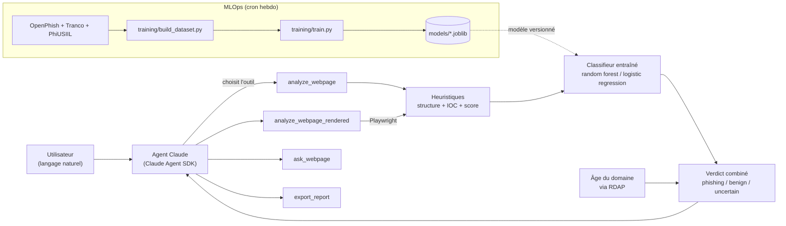

# agentaai — agent de triage web-sécu (Claude Agent SDK)

[](https://github.com/TatianaT13/websec-triage-agent/actions/workflows/tests.yml)
[](https://github.com/TatianaT13/websec-triage-agent/actions/workflows/retrain.yml)
[](LICENSE)

Agent construit avec le [Claude Agent SDK](https://code.claude.com/docs/en/agent-sdk) pour l'analyse défensive de pages web : audit de structure HTML, extraction d'IOC, et score heuristique de phishing. Un outil optionnel basé sur [MarkupLM](https://huggingface.co/docs/transformers/model_doc/markuplm) permet de poser des questions sur le contenu d'une page (QA sur document HTML).

## Architecture



Le classifieur n'est pas statique : un [workflow planifié](.github/workflows/retrain.yml) fait grandir le dataset et réentraîne chaque semaine, en ne committant que si le F1 du nouveau modèle reste sain.

## Exemple réel

Capture d'un run réel sur un échantillon du flux [OpenPhish](https://openphish.com/) (page usurpant WeTransfer, hébergée sur un sous-domaine Vercel) :

```text
$ python main.py "Analyse https://wetransfer-smoky.vercel.app/"

Verdict combiné : PHISHING — les deux signaux sont d'accord
  Heuristique : niveau medium (score 4)
    - brand 'wetransfer' en titre mais le domaine du site est 'wetransfer-smoky.vercel.app'
    - favicon servi depuis un domaine différent de la page
  Classifieur ML : phishing (probabilité 0.86)
```

(voir [Limites connues](#limites-connues) pour ce que cet échantillon réel a permis de corriger pendant la calibration)

## ⚠️ Cadre d'usage

Cet outil est destiné à un usage défensif et autorisé uniquement : tes propres sites, des échantillons de phishing déjà signalés, des labs/CTF. Il ne contourne aucune protection et ne doit pas être pointé vers des cibles sans autorisation.

## Fonctionnalités

- **`analyze_webpage`** : fetch sécurisé (garde-fou anti-SSRF, taille limitée) + structure de la page (formulaires, scripts externes, iframes, favicon) + IOC (domaines, emails, domaines punycode, URLs en IP brute, TLD suspects) + score de phishing heuristique avec raisons + probabilité du classifieur ML (si dispo) + **un verdict combiné unique** (`phishing`/`benign`/`uncertain`) qui réconcilie les deux signaux au lieu de laisser deux avis séparés — voir `websec_agent/verdict.py`.
- **`analyze_webpage_rendered`** (optionnel, nécessite les dépendances render) : même pipeline, mais la page est d'abord rendue dans un navigateur headless (Playwright) — utile quand `analyze_webpage` revient suspicieusement vide parce que le contenu (ex. un formulaire de login) est injecté par du JS côté client.
- **`export_report`** : génère un rapport Markdown + un bundle IOC JSON sur disque, directement depuis les heuristiques (pas d'appel LLM supplémentaire, déterministe) — utilisable aussi en CLI pure via `python scripts/export_report.py <url> [out_dir] [--render]`.
- **`ml_classify_webpage`** (optionnel, nécessite les dépendances MLOps) : appel autonome au classifieur entraîné seul, sans le reste du pipeline — utile pour un score ML rapide. `analyze_webpage` l'inclut déjà dans son verdict combiné.
- **`ask_webpage`** (optionnel, nécessite les dépendances ML) : QA en langage naturel sur le contenu d'une page via MarkupLM.

## Installation

Le SDK pilote le CLI Claude Code en arrière-plan (nécessite Node.js) :

```bash
npm install @anthropic-ai/claude-code

python3 -m venv .venv
source .venv/bin/activate
pip install -r requirements.txt
# optionnel, pour ask_webpage :
pip install -r requirements-ml.txt
# optionnel, pour analyze_webpage_rendered :
pip install -r requirements-render.txt
playwright install chromium
```

Authentification : connecte-toi avec `node_modules/.bin/claude` (login intégré), ou définis la variable d'environnement `ANTHROPIC_API_KEY` (voir `.env.example`).

## Utilisation

```bash
python main.py "Analyse https://example.com et dis-moi si ça ressemble à du phishing"
```

## Tests

```bash
pip install -r requirements-dev.txt
pytest tests/
```

Les fixtures de `tests/test_heuristics.py` reproduisent des patterns observés sur de vrais échantillons du flux public [OpenPhish](https://openphish.com/) pendant la calibration (domaine-sosie sur un hébergeur PaaS, kit de phishing classique avec formulaire externe, domaine punycode...) — voir *Limites connues* ci-dessous pour ce que ça a permis de corriger.

## MLOps : classifieur entraîné

En plus du score heuristique (règles à la main), le projet entraîne un petit classifieur sur des features structurelles/IOC, avec tracking d'expériences et un modèle versionné.

```bash
pip install -r requirements-mlops.txt

# 1. Construit/agrandit le dataset labellisé. Idempotent : re-lancer la commande
#    ajoute de nouvelles URLs sans dupliquer celles déjà présentes (le flux
#    OpenPhish se renouvelle, donc chaque run peut ramener de nouveaux cas).
python training/build_dataset.py 80 data/dataset.csv

# 2. Entraîne (logistic regression + random forest), log les runs dans MLflow (SQLite local),
#    et promeut le meilleur modèle vers models/
python training/train.py data/dataset.csv

# Explorer les runs trackés :
mlflow ui --backend-store-uri sqlite:///mlflow.db
```

**Sources de données** (`training/build_dataset.py`) :

- **Phishing (label=1)** : flux public [OpenPhish](https://openphish.com/) (~300 URLs vivantes à un instant donné, renouvelées en continu).
- **Bénin (label=0)** : une petite liste de sites connus choisis à la main, un échantillon aléatoire de [Tranco](https://tranco-list.eu/) (liste de domaines pensée pour la recherche sécu, plus diversifiée qu'un simple top Alexa), et — si `KAGGLE_API_TOKEN` est défini (ou un token dans `~/.kaggle/access_token`) — un échantillon des URLs légitimes du dataset [PhiUSIIL](https://www.kaggle.com/datasets/ndarvind/phiusiil-phishing-url-dataset) (235k lignes, mais on n'utilise que les légitimes : ses URLs de phishing datent de 2024 et sont quasiment toutes mortes).
- **Risque connu, non filtré** : Tranco et PhiUSIIL sont des classements/datasets tiers, pas vérifiés à la main — un domaine malveillant ou typosquatté qui serait temporairement bien classé pourrait se glisser dans la classe "bénin" (ex. observé en pratique : `paypalverify.net` est apparu comme candidat via Tranco, écarté seulement parce qu'il a timeout). À surveiller si les métriques dérivent anormalement.

**Réentraînement automatique** (`.github/workflows/retrain.yml`) : un job planifié (tous les lundis, ou déclenchable manuellement depuis l'onglet Actions) fait tourner `build_dataset.py` puis `train.py`, vérifie que le F1 du nouveau modèle reste raisonnable, lance les tests, et commit `data/dataset.csv` + `models/` si tout passe. Le secret `KAGGLE_API_TOKEN` est configuré côté repo (GitHub Actions secrets) pour que la source PhiUSIIL fonctionne aussi en CI.

- **Features** (`websec_agent/features.py`) : dérivées de la même analyse de structure/IOC que le score heuristique (formulaires, favicon externe, ratio de scripts/liens externes, marque en titre non alignée avec le domaine, longueur/tirets/chiffres du domaine, etc.) + **âge du domaine via RDAP** (`websec_agent/domain_age.py`) — pas de texte brut, un vecteur numérique fixe.
- **Âge du domaine (RDAP)** : un domaine enregistré il y a quelques jours est un signal classique de phishing, indépendant de la structure/marque. Via l'enregistrement IANA (bootstrap RDAP par TLD), pas l'ancien protocole WHOIS texte. **Non significatif pour les sous-domaines d'hébergeurs PaaS** (`vercel.app`, `pages.dev`, `netlify.app`...) : RDAP ne renvoie que la date d'enregistrement de la plateforme, pas celle du sous-domaine du site observé — détecté et signalé comme tel plutôt que de renvoyer un âge trompeur. Utilisé comme départage uniquement sur les verdicts "incertain" (`websec_agent/verdict.py`), jamais pour écraser un signal déjà net. *Trouvaille concrète pendant les tests : `roblox.com.mu` (le cas "bonne marque, mauvaise extension" documenté comme non détecté) s'est révélé enregistré il y a seulement 121 jours — exactement le genre de cas que ce signal permet de rattraper.*
- **Tracking** : chaque run (modèle, hyperparamètres, métriques, cross-validation 5-fold) est loggé dans MLflow (`mlflow.db`, backend SQLite local, pas de serveur requis).
- **Modèle versionné** : le meilleur modèle (par F1 sur le jeu de test) est copié vers `models/phishing_classifier.joblib` + une fiche modèle `models/phishing_classifier.meta.json` (date d'entraînement, taille du dataset, métriques) — c'est ce que charge l'outil `ml_classify_webpage`.
- **Résultats** : le dataset et le modèle grandissent chaque semaine via le réentraînement automatique (voir ci-dessous) — `models/phishing_classifier.meta.json` contient toujours les chiffres du dernier run (taille du dataset, modèle retenu, métriques). Progression observée : 88 échantillons / F1 ≈ 0,92 → 366 / F1 ≈ 0,96 → 446 / F1 ≈ 0,93, puis **dataset reconstruit à neuf** (160 échantillons / F1 ≈ 0,95) lors de l'ajout de la feature d'âge du domaine — changer le schéma de features invalide les anciennes lignes (elles ne l'avaient pas), donc on régénère plutôt que de bricoler un remplissage factice. **Échelle recherche/démo, pas production** — à réentraîner avec beaucoup plus d'échantillons avant de s'y fier.

## Structure du projet

```text
.
├── main.py                     # point d'entrée de l'agent (conversationnel)
├── websec_agent/
│   ├── web_analysis.py         # fetch + heuristiques (structure, IOC, score phishing, QA MarkupLM)
│   ├── features.py             # vecteur de features numériques pour le classifieur
│   ├── classifier.py           # inférence du modèle entraîné (chargement lazy)
│   ├── verdict.py               # combine score heuristique + ML en un verdict unique
│   ├── render.py                # fetch via navigateur headless (Playwright), optionnel
│   ├── domain_age.py            # âge du domaine via RDAP
│   ├── report.py               # génération du rapport Markdown + bundle IOC JSON
│   └── mcp_server.py           # déclaration des outils exposés à l'agent
├── training/
│   ├── build_dataset.py        # construit data/dataset.csv (phishing réel + bénin)
│   └── train.py                # entraîne, track avec MLflow, promeut le meilleur modèle
├── models/
│   ├── phishing_classifier.joblib      # modèle + scaler entraînés (versionné dans le repo)
│   └── phishing_classifier.meta.json   # fiche modèle (métriques, date, dataset)
├── data/
│   └── dataset.csv             # dataset labellisé (features + label + URL source)
├── scripts/
│   └── export_report.py        # CLI pure (sans LLM) pour exporter un rapport
├── tests/
│   ├── test_heuristics.py      # tests de non-régression basés sur de vrais cas calibrés
│   ├── test_features.py        # tests du vecteur de features
│   ├── test_classifier.py      # tests de forme/plage sur l'inférence (pas de label figé)
│   ├── test_verdict.py         # tests de la logique de combinaison heuristique + ML
│   ├── test_render.py          # tests du fetch via navigateur headless
│   ├── test_fetch_safety.py    # tests du garde-fou SSRF (incl. redirections)
│   ├── test_domain_age.py      # tests du lookup RDAP
│   └── test_report.py          # tests du générateur de rapport/IOC
├── .github/workflows/
│   ├── tests.yml                # CI : tests sur chaque push/PR
│   └── retrain.yml              # cron hebdo : grow dataset + réentraîne + commit si sain
├── requirements.txt
├── requirements-dev.txt
├── requirements-ml.txt
├── requirements-render.txt
├── requirements-mlops.txt
└── .env.example
```

## Limites connues

- Le score de phishing est **heuristique** (règles), calibré sur un petit échantillon réel du flux OpenPhish — pas un modèle entraîné, à continuer d'affiner.
- **Comparaison de domaine correcte** (via `tldextract`, suffixes publics `.co.uk`/`.com.mu`/etc. et hébergeurs PaaS comme `vercel.app`/`pages.dev` où chaque sous-domaine est un site distinct) et **détection des domaines-sosies contenant le nom de la marque** (ex. `wetransfer-smoky.vercel.app`) — corrigés après calibration sur de vrais échantillons.
- **Lacune comblée en pratique, pas par design** : même nom de marque mais mauvaise extension (ex. `roblox.com.mu` au lieu de `roblox.com`) n'est toujours pas détecté par le score heuristique seul (reste "low"). Mais le classifieur ML a appris de lui-même, via la feature d'âge du domaine, à flagger ce cas précis : `roblox.com.mu` (enregistré il y a 121 jours) → verdict final **phishing**, probabilité ML 0,99. Une vraie liste de domaines légitimes par marque reste la solution robuste pour ce pattern en général, mais risquée à maintenir sans faux positifs (variantes régionales légitimes, ex. `amazon.fr`) — ce qu'on a est une corrélation apprise sur un petit dataset, pas une règle garantie.
- MarkupLM est un backbone de compréhension de document HTML (QA, extraction d'info) — il n'est pas pré-entraîné pour classifier du phishing ; `ask_webpage` sert à interroger le contenu, pas à obtenir un verdict de sécurité direct.
- `analyze_webpage` n'exécute pas le JS par défaut (rapide, mais aveugle à un contenu injecté côté client) ; `analyze_webpage_rendered` couvre ce cas via Playwright, mais c'est à l'agent de détecter qu'une page a besoin du rendu (heuristique simple : page qui semble vide) — pas automatique ni garanti.
- ~~Le garde-fou anti-SSRF ne revérifiait pas après une redirection HTTP~~ — **corrigé** : chaque redirection (et, côté navigateur headless, chaque sous-requête de la page) revalide désormais le nom d'hôte ; testé avec un vrai redirecteur HTTP vers l'IP de métadonnées cloud (`169.254.169.254`), bloqué comme attendu.
- ~~Pas de protection contre le DNS rebinding~~ — **corrigé après revue de sécurité** (`/security-review`) : le hostname n'était validé qu'une fois, puis `requests`/Chromium refaisaient leur propre résolution DNS indépendante à la connexion — un attaquant contrôlant le DNS de son propre domaine (exactement le cas ici, puisqu'on analyse des URLs de phishing) pouvait répondre différemment aux deux résolutions pour contourner le garde-fou. Corrigé en épinglant la connexion aux IP déjà validées : monkeypatch scopé de `socket.getaddrinfo` côté `fetch_html`, flag `--host-resolver-rules` de Chromium côté rendu navigateur. Les deux vérifiés avec une simulation réelle de rebinding (voir `tests/test_fetch_safety.py` et `tests/test_render.py`). **Résidu restant, honnêtement limité** : côté navigateur headless, seul le nom d'hôte de la page demandée est épinglé — une redirection ou une sous-ressource vers un *second* domaine contrôlé par l'attaquant reste protégée par la revalidation par requête (`_guard_route`), mais pas épinglée.

## Prochaines étapes possibles

- Liste de domaines légitimes par marque (avec gestion des variantes régionales) pour couvrir le cas "bonne marque, mauvaise extension".
- Filtrage/vérification manuelle des candidats Tranco/PhiUSIIL avant de les labelliser "bénin" (risque de faux négatifs décrit ci-dessus).
- Dataset d'entraînement plus large (centaines/milliers d'échantillons) pour un classifieur plus fiable qu'un modèle de démo.
- v2 MLOps : embeddings MarkupLM gelés comme features supplémentaires (voir discussion dans l'historique du projet) si le dataset grandit assez pour le justifier.
- Déclencher `analyze_webpage_rendered` automatiquement (plutôt que l'agent devine) quand `analyze_webpage` revient vide pour une page qui ne devrait pas l'être.
