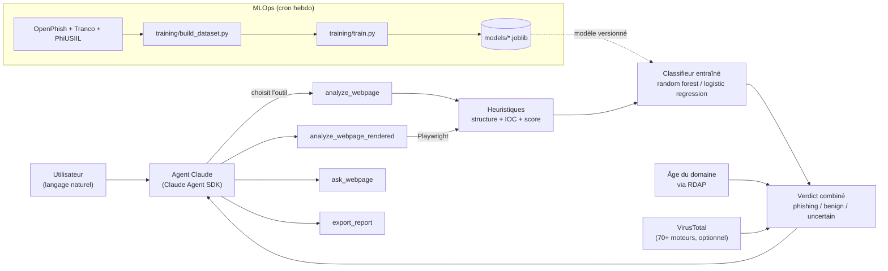

# agentaai — agent de triage web-sécu (Claude Agent SDK)

[](https://github.com/TatianaT13/websec-triage-agent/actions/workflows/tests.yml)
[](https://github.com/TatianaT13/websec-triage-agent/actions/workflows/retrain.yml)
[](LICENSE)

Agent construit avec le [Claude Agent SDK](https://code.claude.com/docs/en/agent-sdk) pour l'analyse défensive de pages web : audit de structure HTML, extraction d'IOC, et score heuristique de phishing. Un outil optionnel basé sur [MarkupLM](https://huggingface.co/docs/transformers/model_doc/markuplm) permet de poser des questions sur le contenu d'une page (QA sur document HTML).

## Architecture



Le classifieur n'est pas statique : un [workflow planifié](.github/workflows/retrain.yml) fait grandir le dataset et réentraîne chaque semaine, en ne committant que si le F1 du nouveau modèle reste sain.

## Exemple réel

Capture d'un run réel sur un échantillon du flux [OpenPhish](https://openphish.com/) (page usurpant WeTransfer, hébergée sur un sous-domaine Vercel) :

```text
$ python main.py "Analyse https://wetransfer-smoky.vercel.app/ en vérifiant aussi VirusTotal"

Verdict combiné : PHISHING — both signals agree; VirusTotal: 13 security vendor(s) flag this URL as malicious
  Heuristique : niveau medium (score 4)
    - brand 'wetransfer' en titre mais le domaine du site est 'wetransfer-smoky.vercel.app'
    - favicon servi depuis un domaine différent de la page
  Classifieur ML : phishing (probabilité 0.9985)
  VirusTotal (déjà en cache) : 13 malveillants, 1 suspect, 47 inoffensifs, 31 sans détection
```

(voir [Limites connues](#limites-connues) pour ce que cet échantillon réel a permis de corriger pendant la calibration)

## ⚠️ Cadre d'usage

Cet outil est destiné à un usage défensif et autorisé uniquement : tes propres sites, des échantillons de phishing déjà signalés, des labs/CTF. Il ne contourne aucune protection et ne doit pas être pointé vers des cibles sans autorisation.

## Fonctionnalités

- **`analyze_webpage`** : fetch sécurisé (garde-fou anti-SSRF, taille limitée) + structure de la page (formulaires, scripts externes, iframes, favicon) + IOC (domaines, emails, domaines punycode, URLs en IP brute, TLD suspects) + score de phishing heuristique avec raisons + probabilité du classifieur ML (si dispo) + **un verdict combiné unique** (`phishing`/`benign`/`uncertain`) qui réconcilie les deux signaux au lieu de laisser deux avis séparés — voir `websec_agent/verdict.py`. Si le fetch brut revient suspicieusement vide (aucun formulaire/lien/texte — le cas classique d'une single-page app dont le contenu est injecté par du JS), **relance automatiquement via un navigateur headless** (voir `analyze_webpage_rendered` ci-dessous) plutôt que de compter sur l'agent pour le remarquer — `result["auto_rendered"]` dit si ça s'est produit. Repli silencieux sur le résultat brut si les dépendances render ne sont pas installées ou si le rendu échoue.
- **`analyze_webpage_rendered`** (optionnel, nécessite les dépendances render) : même pipeline, mais la page est **toujours** rendue dans un navigateur headless (Playwright), sans la vérification "ça a l'air vide" — pour forcer le rendu dès le départ quand on sait déjà qu'il sera nécessaire, ou quand l'heuristique auto-retry de `analyze_webpage` manque un cas (page textuellement non-vide mais dont le contenu pertinent, lui, est injecté par JS).
- **`export_report`** : génère un rapport Markdown + un bundle IOC JSON sur disque, directement depuis les heuristiques (pas d'appel LLM supplémentaire, déterministe) — utilisable aussi en CLI pure via `python scripts/export_report.py <url> [out_dir] [--render]`.
- **`ml_classify_webpage`** (optionnel, nécessite les dépendances MLOps) : appel autonome au classifieur entraîné seul, sans le reste du pipeline — utile pour un score ML rapide. `analyze_webpage` l'inclut déjà dans son verdict combiné.
- **`check_virustotal`** / `analyze_webpage(check_virustotal=true)` (optionnel, nécessite `requirements-threatintel.txt` + une clé `VT_API_KEY` gratuite) : interroge 70+ moteurs de sécurité réels. Un verdict malveillant **l'emporte** sur nos propres signaux (vraie donnée vendeur, pas juste notre petit modèle) ; un rapport propre ne fait que départager un cas "incertain". Coûte du quota (4 requêtes/min, 500/jour en gratuit) et peut prendre jusqu'à ~30s pour une URL inconnue de VT — désactivé par défaut.
- **`ask_webpage`** (optionnel, nécessite les dépendances ML) : QA en langage naturel sur le contenu d'une page via MarkupLM.
- **`analyze_html`** : même pipeline que `analyze_webpage`, mais sur du HTML qu'on fournit directement (collé), sans fetch réseau — utile quand la page est déjà tombée entre le signalement et l'analyse. Demande un `url_hint` (l'URL supposée, même morte) pour donner un point de comparaison aux heuristiques de marque/domaine.
- **`analyze_email`** : même chose à partir d'un fichier `.eml` sur disque — extrait le corps HTML (repli sur le texte brut sinon), et utilise par défaut **le domaine de l'expéditeur** comme `url_hint`, ce qui détourne intelligemment l'heuristique marque/domaine pour repérer un expéditeur usurpé ("PayPal" envoyé depuis un domaine qui n'est pas paypal.com). Parse aussi **SPF/DKIM/DMARC** depuis l'en-tête `Authentication-Results` : un **échec** fait basculer le verdict vers phishing (asymétrique — un succès n'est volontairement **jamais** traité comme rassurant, voir *Limites connues*). Cas réel testé : un expéditeur usurpé à `service@paypal.com` passait inaperçu de tous les autres signaux (le domaine "paypal.com" matchait la marque, aucune incohérence structurelle) — seul SPF/DMARC a révélé l'usurpation.
- **`analyze_qr_code`** (optionnel, nécessite `requirements-qr.txt`) : décode une image de QR code (OpenCV) et lance le pipeline complet sur l'URL qu'il contient — pour le *quishing* (QR malveillant collé sur un parcmètre, une facture, une affiche...). Si le QR encode autre chose qu'une URL (texte, vCard, Wi-Fi...), renvoie le contenu brut au lieu de forcer une analyse web.

## Installation

Le SDK pilote le CLI Claude Code en arrière-plan (nécessite Node.js) :

```bash
npm install @anthropic-ai/claude-code

python3 -m venv .venv
source .venv/bin/activate
pip install -r requirements.txt
# optionnel, pour ask_webpage :
pip install -r requirements-ml.txt
# optionnel, pour analyze_webpage_rendered :
pip install -r requirements-render.txt
playwright install chromium
# optionnel, pour check_virustotal :
pip install -r requirements-threatintel.txt
export VT_API_KEY="..."  # clé gratuite sur virustotal.com -> icône profil -> API Key
# optionnel, pour analyze_qr_code :
pip install -r requirements-qr.txt
```

Authentification : connecte-toi avec `node_modules/.bin/claude` (login intégré), ou définis la variable d'environnement `ANTHROPIC_API_KEY` (voir `.env.example`).

## Utilisation

```bash
python main.py "Analyse https://example.com et dis-moi si ça ressemble à du phishing"
```

Sortie lisible : seuls les outils utilisés et la réponse de l'agent s'affichent (pas le bruit interne du SDK).

### Interface web (mode rapide, sans agent)

Pour une analyse instantanée avec un badge coloré plutôt qu'une conversation — appelle directement le pipeline heuristique + ML + RDAP, sans passer par Claude (gratuit, pas d'explication en langage naturel). Quatre onglets (CSS pur, pas de JS) couvrant les mêmes points d'entrée que l'agent : **URL**, **HTML collé** (page déjà morte), **email `.eml`** (avec vérification SPF/DKIM/DMARC) et **QR code** (quishing) :

```bash
pip install -r requirements-web.txt
uvicorn webapp:app --reload
# pour l'onglet QR code, optionnel :
pip install -r requirements-qr.txt
```

Puis ouvre <http://127.0.0.1:8000>. Ne pas exposer ça sur un réseau sans ajouter une authentification — c'est un outil local, sans contrôle d'accès, qui va chercher n'importe quelle URL qu'on lui soumet (ou décode n'importe quel fichier qu'on lui envoie).

## Tests

```bash
pip install -r requirements-dev.txt
pytest tests/
```

Les fixtures de `tests/test_heuristics.py` reproduisent des patterns observés sur de vrais échantillons du flux public [OpenPhish](https://openphish.com/) pendant la calibration (domaine-sosie sur un hébergeur PaaS, kit de phishing classique avec formulaire externe, domaine punycode...) — voir *Limites connues* ci-dessous pour ce que ça a permis de corriger.

## MLOps : classifieur entraîné

En plus du score heuristique (règles à la main), le projet entraîne un petit classifieur sur des features structurelles/IOC, avec tracking d'expériences et un modèle versionné.

```bash
pip install -r requirements-mlops.txt

# 1. Construit/agrandit le dataset labellisé. Idempotent : re-lancer la commande
#    ajoute de nouvelles URLs sans dupliquer celles déjà présentes (le flux
#    OpenPhish se renouvelle, donc chaque run peut ramener de nouveaux cas).
python training/build_dataset.py 80 data/dataset.csv

# 2. Entraîne (logistic regression + random forest), log les runs dans MLflow (SQLite local),
#    et promeut le meilleur modèle vers models/
python training/train.py data/dataset.csv

# 3. Entraîne le méta-modèle de verdict (voir ci-dessous)
python training/train_verdict_meta.py data/dataset.csv

# 4. (optionnel, nécessite requirements-ml.txt) recollecte un sous-ensemble
#    avec embeddings MarkupLM gelés, puis compare contre les features seules :
python training/build_dataset.py 80 data/dataset.csv --with-embeddings
python training/train_with_embeddings.py data/dataset.csv

# Explorer les runs trackés :
mlflow ui --backend-store-uri sqlite:///mlflow.db
```

### Méta-modèle de verdict (stacking)

`websec_agent/verdict.py` combinait heuristique + ML + âge du domaine avec des seuils choisis à l'œil (`PHISHING_PROB_HIGH = 0.75`, etc.). `training/train_verdict_meta.py` entraîne à la place une petite régression logistique sur 4 entrées (`heuristic_score`, `ml_probability`, `domain_age_days`, `domain_age_unknown`) qui apprend elle-même comment les pondérer.

- **Stacking propre** : la probabilité ML utilisée comme entrée est calculée en *out-of-fold* (`cross_val_predict`) — jamais la prédiction d'un modèle sur les données qu'il a vues à l'entraînement, sinon le méta-modèle apprendrait à sur-faire confiance au premier modèle.
- **VirusTotal reste hors du méta-modèle** : on n'a pas de données VT historiques pour l'entraîner (volontairement jamais interrogé pendant la collecte, cf. coût du quota), et "faire confiance à un vrai moteur antivirus" n'a pas vraiment besoin d'être appris — ça reste l'override codé à la main déjà en place.
- **Comparaison honnête contre l'ancien code, et promotion conditionnelle** : le script réévalue aussi les seuils codés à la main sur les mêmes lignes de test — pas pour information seulement : `training/train_verdict_meta.py` ne sauvegarde le modèle appris QUE s'il bat strictement la baseline sur ce run (`_should_promote`) ; sinon le fichier modèle (et son `meta.json`) existant restent intacts, et `card["promoted"]` dans le `meta.json` dit lequel des deux cas s'est produit. Historique réel, pas hypothétique : sur 160 échantillons, F1 0,947 (appris) contre 0,919 (seuils à la main) — promu. Après avoir fait grandir le dataset à 360, 427 puis 701 échantillons (voir *Résultats* ci-dessous), le modèle réentraîné retombe à chaque fois entre F1 0,89 et 0,91 contre ~0,90-0,95 pour la baseline sur ces nouveaux splits — **pas promu, à chaque run**, l'ancien modèle (160 échantillons, toujours meilleur à ce jour) est resté en place. Sans cette vérification, on aurait silencieusement dégradé le verdict en production avec un modèle "plus récent" mais objectivement pire.
- **Repli automatique** : si `models/verdict_meta_model.joblib` n'existe pas (ou que les extras MLOps ne sont pas installés), `combine_verdicts()` retombe sur les seuils codés à la main — jamais d'erreur, juste moins précis.
- **Coefficients interprétables** : contrairement à un modèle plus opaque, on peut lire l'importance relative de chaque signal directement dans `models/verdict_meta_model.meta.json`.

### v2 (expérimental) : embeddings MarkupLM gelés

Piste additive, séparée du classifieur principal : un embedding **gelé** (`websec_agent/markuplm_embeddings.py`, `microsoft/markuplm-base` — le checkpoint de base, pas le `-finetuned-websrc` déjà utilisé par `ask_webpage`) résumant la structure DOM + le texte de la page en un vecteur fixe de 768 dimensions, moyenné sur les tokens réels (masque d'attention), concaténé aux features structurelles existantes.

- **Pourquoi "gelé"** : le transformer n'est jamais fine-tuné ici, seulement utilisé comme extracteur de features fixe (comme un CNN pré-entraîné en transfer learning) — pas de coût d'entraînement supplémentaire, juste un forward pass par page.
- **Capturé uniquement à la collecte** (`python training/build_dataset.py <n> data/dataset.csv --with-embeddings`) : c'est le seul moment où le HTML brut est encore disponible — le dataset ne le stocke jamais (voir docstring de `build_dataset.py`). Les lignes historiques collectées sans ce flag ont simplement une colonne `markuplm_embedding` vide ; ce n'est pas rétroactif.
- **PCA avant concatenation** (`training/train_with_embeddings.py`) : 768 dimensions contre quelques centaines de lignes est un risque de surapprentissage sévère pour une régression logistique — l'embedding est d'abord réduit par PCA (fit sur le train seulement, pour éviter toute fuite) avant d'être concatené aux features structurelles.
- **Comparaison honnête, piste séparée du classifieur principal** : `train_with_embeddings.py` compare "features structurelles seules" contre "+ embedding" sur les mêmes lignes de test et imprime les deux F1 côte à côte, sans trancher à l'avance. Rien dans le pipeline `analyze_webpage` par défaut ne dépend de ce module.
- **Résultat réel, à prendre avec précaution** : sur les 67 lignes actuellement collectées avec embedding (27 phish, 40 bénin — un sous-ensemble du dataset de 427 lignes, voir plus haut pourquoi ce n'est qu'un sous-ensemble), F1 passe de 0,857 (features seules) à 0,933 (+ embedding, PCA à 20 composantes). Encourageant, mais le jeu de test ne fait qu'une vingtaine de lignes (30% de 67) — largement trop peu pour conclure que l'embedding "marche vraiment" plutôt que d'avoir eu de la chance sur ce split précis. À re-mesurer après avoir fait grandir ce sous-ensemble (`python training/build_dataset.py <n> data/dataset.csv --with-embeddings`) avant d'envisager de le brancher ailleurs que dans ce script de comparaison.

**Sources de données** (`training/build_dataset.py`) :

- **Phishing (label=1)** : flux public [OpenPhish](https://openphish.com/) (~300 URLs vivantes à un instant donné, renouvelées en continu).
- **Bénin (label=0)** : une petite liste de sites connus choisis à la main, un échantillon aléatoire de [Tranco](https://tranco-list.eu/) (liste de domaines pensée pour la recherche sécu, plus diversifiée qu'un simple top Alexa), et — si `KAGGLE_API_TOKEN` est défini (ou un token dans `~/.kaggle/access_token`) — un échantillon des URLs légitimes du dataset [PhiUSIIL](https://www.kaggle.com/datasets/ndarvind/phiusiil-phishing-url-dataset) (235k lignes, mais on n'utilise que les légitimes : ses URLs de phishing datent de 2024 et sont quasiment toutes mortes).
- **Filtrés avant d'être labellisés "bénin"** : Tranco et PhiUSIIL sont des classements/datasets tiers, pas vérifiés à la main — un domaine malveillant ou typosquatté temporairement bien classé pourrait sinon se glisser dans la classe "bénin" (observé en pratique : `paypalverify.net` est apparu comme candidat via Tranco, écarté seulement parce qu'il a timeout). `collect(..., verify_benign=True)` passe chaque candidat Tranco/PhiUSIIL par `_reject_reason()` — qui réutilise les features déjà calculées (donc gratuit, aucun appel réseau en plus) — et rejette tout candidat dont nos propres heuristiques détectent un mismatch marque/domaine ou un score heuristique medium/high, avant de le faire confiance comme label=0. La liste de sites choisis à la main (`BENIGN_URLS`) reste, elle, prise telle quelle. Filtre imparfait par construction (il ne voit que ce que nos propres heuristiques savent détecter) — à surveiller si les métriques dérivent anormalement.

**Réentraînement automatique** (`.github/workflows/retrain.yml`) : un job planifié (tous les lundis, ou déclenchable manuellement depuis l'onglet Actions) fait tourner `build_dataset.py` puis `train.py`, vérifie que le F1 du nouveau modèle reste raisonnable, lance les tests, et commit `data/dataset.csv` + `models/` si tout passe. Le secret `KAGGLE_API_TOKEN` est configuré côté repo (GitHub Actions secrets) pour que la source PhiUSIIL fonctionne aussi en CI.

- **Features** (`websec_agent/features.py`) : dérivées de la même analyse de structure/IOC que le score heuristique (formulaires, favicon externe, ratio de scripts/liens externes, marque en titre non alignée avec le domaine, longueur/tirets/chiffres du domaine, etc.) + **âge du domaine via RDAP** (`websec_agent/domain_age.py`) — pas de texte brut, un vecteur numérique fixe.
- **Âge du domaine (RDAP)** : un domaine enregistré il y a quelques jours est un signal classique de phishing, indépendant de la structure/marque. Via l'enregistrement IANA (bootstrap RDAP par TLD), pas l'ancien protocole WHOIS texte. **Non significatif pour les sous-domaines d'hébergeurs PaaS** (`vercel.app`, `pages.dev`, `netlify.app`...) : RDAP ne renvoie que la date d'enregistrement de la plateforme, pas celle du sous-domaine du site observé — détecté et signalé comme tel plutôt que de renvoyer un âge trompeur. Utilisé comme départage uniquement sur les verdicts "incertain" (`websec_agent/verdict.py`), jamais pour écraser un signal déjà net. *Trouvaille concrète pendant les tests : `roblox.com.mu` (le cas "bonne marque, mauvaise extension" documenté comme non détecté) s'est révélé enregistré il y a seulement 121 jours — exactement le genre de cas que ce signal permet de rattraper.* **Limite observée en usage réel** : la disponibilité RDAP varie selon le registre — `.fr` renvoie la date d'enregistrement, `.it` n'en a renvoyé aucune lors d'un test réel (certains registres ne la publient pas, souvent pour des raisons de vie privée). `age_days` reste `None` dans ce cas, sans fausse certitude.
- **Tracking** : chaque run (modèle, hyperparamètres, métriques, cross-validation 5-fold) est loggé dans MLflow (`mlflow.db`, backend SQLite local, pas de serveur requis).
- **Modèle versionné** : le meilleur modèle (par F1 sur le jeu de test) est copié vers `models/phishing_classifier.joblib` + une fiche modèle `models/phishing_classifier.meta.json` (date d'entraînement, taille du dataset, métriques) — c'est ce que charge l'outil `ml_classify_webpage`.
- **Résultats** : le dataset et le modèle grandissent chaque semaine via le réentraînement automatique (voir ci-dessous) — `models/phishing_classifier.meta.json` contient toujours les chiffres du dernier run (taille du dataset, modèle retenu, métriques). Progression observée : 88 échantillons / F1 ≈ 0,92 → 366 / F1 ≈ 0,96 → 446 / F1 ≈ 0,93, puis **dataset reconstruit à neuf** (160 échantillons / F1 ≈ 0,95) lors de l'ajout de la feature d'âge du domaine — changer le schéma de features invalide les anciennes lignes (elles ne l'avaient pas), donc on régénère plutôt que de bricoler un remplissage factice. Dataset ensuite doublé à 360 échantillons (180/180) avec le filtre Tranco/PhiUSIIL déjà actif (voir *Limites connues* plus haut), complété à 427 lors de la collecte dédiée aux embeddings MarkupLM (voir plus bas), puis agrandi à 701 (331 phish, 370 bénin) : `random_forest` promu à chaque run, F1 oscillant entre 0,91 et 0,95 selon le split, cv_f1 0,935±0,026 sur les 701 lignes actuelles — stable, sans tendance claire à l'amélioration ni à la dégradation. Voir aussi la note sur le méta-modèle de verdict ci-dessus, qui lui N'A PAS été promu sur ces trois derniers runs. **Échelle recherche/démo, pas production** — à réentraîner avec beaucoup plus d'échantillons avant de s'y fier.

## Structure du projet

```text
.
├── main.py                     # point d'entrée de l'agent (conversationnel)
├── websec_agent/
│   ├── web_analysis.py         # fetch + heuristiques (structure, IOC, score phishing, QA MarkupLM)
│   ├── features.py             # vecteur de features numériques pour le classifieur
│   ├── classifier.py           # inférence du modèle entraîné (chargement lazy)
│   ├── model_security.py       # scan picklescan avant de charger un modèle tiers (MarkupLM)
│   ├── verdict.py               # combine score heuristique + ML en un verdict unique
│   ├── render.py                # fetch via navigateur headless (Playwright), optionnel
│   ├── domain_age.py            # âge du domaine via RDAP
│   ├── virustotal.py            # vérification VirusTotal (70+ moteurs), optionnel
│   ├── offline_content.py      # extraction HTML + SPF/DKIM/DMARC depuis un .eml
│   ├── qr_decode.py            # décodage de QR code (OpenCV), optionnel
│   ├── markuplm_embeddings.py  # embedding MarkupLM gelé (v2 MLOps, optionnel), voir plus bas
│   ├── report.py               # génération du rapport Markdown + bundle IOC JSON
│   └── mcp_server.py           # déclaration des outils exposés à l'agent
├── webapp.py                    # interface web FastAPI (mode rapide, sans agent), optionnelle
├── templates/                    # templates Jinja2 de l'interface web
├── training/
│   ├── build_dataset.py        # construit data/dataset.csv (phishing réel + bénin)
│   ├── train.py                # entraîne, track avec MLflow, promeut le meilleur modèle
│   ├── train_verdict_meta.py   # entraîne le méta-modèle qui combine heuristique+ML+âge
│   └── train_with_embeddings.py # v2 MLOps : compare features seules vs + embeddings MarkupLM
├── models/
│   ├── phishing_classifier.joblib      # modèle + scaler entraînés (versionné dans le repo)
│   ├── phishing_classifier.meta.json   # fiche modèle (métriques, date, dataset)
│   ├── verdict_meta_model.joblib       # méta-modèle de combinaison des signaux
│   └── verdict_meta_model.meta.json    # fiche modèle (métriques + comparaison au seuils à la main)
├── data/
│   └── dataset.csv             # dataset labellisé (features + label + URL source)
├── scripts/
│   └── export_report.py        # CLI pure (sans LLM) pour exporter un rapport
├── tests/
│   ├── test_heuristics.py      # tests de non-régression basés sur de vrais cas calibrés
│   ├── test_features.py        # tests du vecteur de features
│   ├── test_classifier.py      # tests de forme/plage sur l'inférence (pas de label figé)
│   ├── test_verdict.py         # tests du repli codé à la main (sans méta-modèle)
│   ├── test_verdict_meta.py    # tests du chemin méta-modèle (faux modèle à coefficients fixes)
│   ├── test_render.py          # tests du fetch via navigateur headless
│   ├── test_fetch_safety.py    # tests du garde-fou SSRF (incl. redirections)
│   ├── test_domain_age.py      # tests du lookup RDAP
│   ├── test_model_security.py  # tests du scan picklescan (incl. pickle malveillant réel)
│   ├── test_virustotal.py      # tests du client VirusTotal (mocké, + vérifié en live)
│   ├── test_webapp.py          # tests de l'interface web (4 onglets, incl. protection XSS)
│   ├── test_offline_content.py # tests de l'extraction .eml + SPF/DKIM/DMARC
│   ├── test_qr_decode.py       # tests du décodage QR (vrai QR généré + vérifié)
│   ├── test_build_result_from_html.py  # tests du pipeline sans fetch réseau
│   ├── test_build_dataset.py   # tests du filtre de vérification des candidats bénins + deadline réseau
│   ├── test_markuplm_embeddings.py  # tests du pooling d'embedding (faux modèle, pas de réseau)
│   ├── test_train_with_embeddings.py  # tests du parsing/filtrage des lignes avec embedding
│   ├── test_train_verdict_meta_promotion.py  # tests de la porte de promotion (ne jamais ecraser par pire)
│   ├── test_auto_render.py     # tests du rendu JS automatique quand le fetch brut semble vide
│   └── test_report.py          # tests du générateur de rapport/IOC
├── .github/workflows/
│   ├── tests.yml                # CI : tests sur chaque push/PR
│   └── retrain.yml              # cron hebdo : grow dataset + réentraîne + commit si sain
├── requirements.txt
├── requirements-dev.txt
├── requirements-ml.txt
├── requirements-render.txt
├── requirements-mlops.txt
├── requirements-threatintel.txt
├── requirements-qr.txt
├── requirements-web.txt
└── .env.example
```

## Limites connues

- Le score de phishing est **heuristique** (règles), calibré sur un petit échantillon réel du flux OpenPhish — pas un modèle entraîné, à continuer d'affiner.
- **Comparaison de domaine correcte** (via `tldextract`, suffixes publics `.co.uk`/`.com.mu`/etc. et hébergeurs PaaS comme `vercel.app`/`pages.dev` où chaque sous-domaine est un site distinct) et **détection des domaines-sosies contenant le nom de la marque** (ex. `wetransfer-smoky.vercel.app`) — corrigés après calibration sur de vrais échantillons.
- ~~Même nom de marque mais mauvaise extension (ex. `roblox.com.mu` au lieu de `roblox.com`) non détecté par le score heuristique seul~~ — **corrigé** : `score_phishing` comparait seulement le *label* du domaine (la partie avant le suffixe public), donc n'importe quel TLD avec le même label passait pour "le vrai domaine de la marque" (`roblox.com.mu`, mais aussi `paypal.de`, `netflix.co`...). Remplacé par `BRAND_LEGITIMATE_DOMAINS` (`websec_agent/web_analysis.py`) : une liste explicite de domaines réellement légitimes par marque, avec gestion des vraies variantes régionales (`amazon.fr`, `amazon.de`, `ebay.co.uk`...) qui elles ne doivent pas être flaggées. A aussi révélé et corrigé un bug préexistant dans l'autre sens : `booking.com` (dont le nom de marque contient déjà ".com") s'auto-flaggait sur son propre vrai site, et `steam` (dont le vrai domaine est `steampowered.com`, pas `steam.com`) aurait fait la même chose. Marques non listées explicitement : repli sur `<marque>.com`, identique au comportement précédent pour ces cas.
- MarkupLM est un backbone de compréhension de document HTML (QA, extraction d'info) — il n'est pas pré-entraîné pour classifier du phishing ; `ask_webpage` sert à interroger le contenu, pas à obtenir un verdict de sécurité direct.
- **Scan de sécurité des modèles tiers** (`websec_agent/model_security.py`) : le checkpoint MarkupLM qu'on utilise n'est distribué qu'en `pytorch_model.bin` (pickle), pas en `safetensors` — la désérialisation pickle peut exécuter du code arbitraire (cas réels documentés de modèles piégés sur des hubs publics). Avant tout chargement, le fichier est scanné avec `picklescan` (le même outil qu'utilise Hugging Face en interne) ; le chargement est refusé si un global non-anodin est détecté. Vérifié avec un vrai pickle malveillant (gadget `__reduce__` → `os.system`), correctement détecté comme `Dangerous` — le checkpoint réel qu'on utilise scanne propre.
- `analyze_webpage` n'exécute pas le JS par défaut (rapide, mais aveugle à un contenu injecté côté client) — mais relance automatiquement via Playwright (`websec_agent.render`) quand le fetch brut a l'air vide (`web_analysis.looks_js_rendered_empty` : moins de 40 caractères de texte visible, aucun formulaire, aucun lien). **Heuristique, pas garantie** : un seuil fixe sur la quantité de texte peut rater une page dont le contenu PERTINENT (ex. un formulaire de login) est injecté par JS alors que la page affiche déjà un peu de texte statique (bannière, footer...) — dans ce cas, `analyze_webpage_rendered` reste disponible pour forcer le rendu explicitement.
- ~~Le garde-fou anti-SSRF ne revérifiait pas après une redirection HTTP~~ — **corrigé** : chaque redirection (et, côté navigateur headless, chaque sous-requête de la page) revalide désormais le nom d'hôte ; testé avec un vrai redirecteur HTTP vers l'IP de métadonnées cloud (`169.254.169.254`), bloqué comme attendu.
- ~~Pas de protection contre le DNS rebinding~~ — **corrigé après revue de sécurité** (`/security-review`) : le hostname n'était validé qu'une fois, puis `requests`/Chromium refaisaient leur propre résolution DNS indépendante à la connexion — un attaquant contrôlant le DNS de son propre domaine (exactement le cas ici, puisqu'on analyse des URLs de phishing) pouvait répondre différemment aux deux résolutions pour contourner le garde-fou. Corrigé en épinglant la connexion aux IP déjà validées : monkeypatch scopé de `socket.getaddrinfo` côté `fetch_html`, flag `--host-resolver-rules` de Chromium côté rendu navigateur. Les deux vérifiés avec une simulation réelle de rebinding (voir `tests/test_fetch_safety.py` et `tests/test_render.py`). **Résidu restant, honnêtement limité** : côté navigateur headless, seul le nom d'hôte de la page demandée est épinglé — une redirection ou une sous-ressource vers un *second* domaine contrôlé par l'attaquant reste protégée par la revalidation par requête (`_guard_route`), mais pas épinglée.
- **VirusTotal n'est pas gratuit à volonté** : quota de 4 requêtes/min et 500/jour sur le tier gratuit, et volontairement non branché dans `training/build_dataset.py`/le réentraînement automatique (trop lent — jusqu'à ~30s/URL pour une soumission fraîche — et ça viderait le quota en quelques minutes sur un run qui traite des dizaines d'URLs). C'est un signal pour l'analyse interactive, pas pour l'entraînement.
- URL soumises à VirusTotal (cas d'une URL que VT ne connaît pas encore) sont ajoutées à leur dataset et deviennent visibles publiquement — normal et voulu pour du phishing qu'on analyse, mais à garder en tête si tu pointais l'outil vers autre chose.
- **SPF/DKIM/DMARC (`analyze_email`) sont auto-déclarés par le serveur qui a ajouté l'en-tête `Authentication-Results`, pas vérifiés par nous.** Un `.eml` fabriqué à la main par un attaquant (ou passé par un hop de transfert non fiable) pourrait contenir un en-tête forgé. C'est pour ça qu'un **succès n'est jamais traité comme une preuve de bénignité** — seul un **échec explicite** pousse vers phishing, et le texte du verdict dit toujours explicitement "rapporté par le serveur récepteur, non revérifié". Revérification indépendante (parser la chaîne `Received:` pour retrouver l'IP d'origine + refaire la requête DNS SPF nous-mêmes) serait plus solide mais nettement plus complexe — non fait pour l'instant.

## Prochaines étapes possibles

- Dataset d'entraînement encore plus large (actuellement 701 échantillons, voir *Résultats* plus haut) — viser le millier pour sortir vraiment de l'échelle démo.
